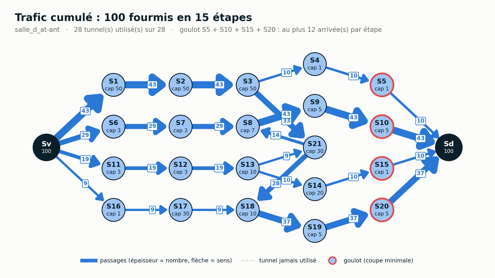
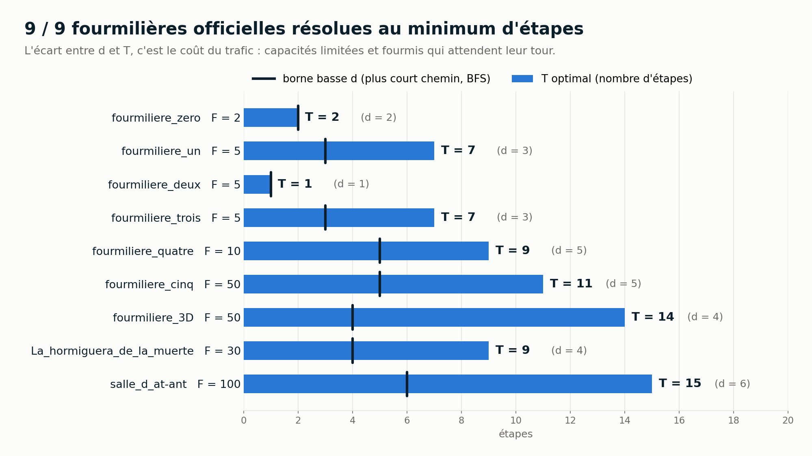
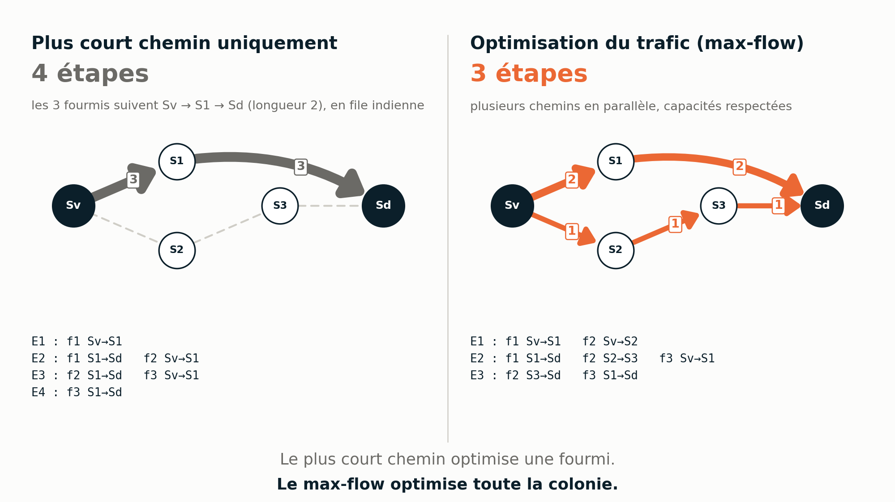

# Une vie de fourmi

Projet Python : algorithmique, graphes, optimisation. **Équipe : Romain · Lisa · Yannis**



## 1. La problématique

Une colonie de `F` fourmis attend dans le vestibule `Sv` et doit rejoindre le dortoir `Sd` **en un minimum d'étapes**. La fourmilière est faite de salles reliées par des tunnels.

- À chaque étape, chaque fourmi **attend** ou **passe dans une salle voisine** ; tous les déplacements sont simultanés.
- Une salle intermédiaire accueille **1 fourmi** par défaut, ou **X fourmis** si elle est notée `SN{X}`. `Sv`, `Sd` et les tunnels ne sont pas limités.
- Une fourmi peut entrer dans une salle au moment où l'occupante la quitte.
- Le nombre d'étapes est celui de l'arrivée de la **dernière** fourmi.

Le plus court chemin ne suffit pas : si toutes les fourmis le prennent, les salles saturent. **Ce n'est pas un problème de chemin, c'est un problème de trafic.**

## 2. Résultats sur les 9 fourmilières officielles

| Fichier | F | Salles | Tunnels | d (BFS) | **T optimal** | Temps |
|---|---:|---:|---:|---:|---:|---:|
| fourmiliere_zero | 2 | 2 | 4 | 2 | **2** | < 1 ms |
| fourmiliere_un | 5 | 2 | 3 | 3 | **7** | 5 ms |
| fourmiliere_deux | 5 | 2 | 4 | 1 | **1** | < 1 ms |
| fourmiliere_trois | 5 | 4 | 5 | 3 | **7** | 6 ms |
| fourmiliere_quatre | 10 | 6 | 9 | 5 | **9** | 18 ms |
| fourmiliere_cinq | 50 | 14 | 20 | 5 | **11** | 55 ms |
| fourmiliere_3D | 50 | 9 | 15 | 4 | **14** | 85 ms |
| La_hormiguera_de_la_muerte | 30 | 10 | 46 | 4 | **9** | 50 ms |
| salle_d_at-ant | 100 | 21 | 28 | 6 | **15** | 245 ms |

**9 / 9 résolus.** Chaque solution est vérifiée : capacités à chaque instant, tunnels existants, départ de `Sv`, arrivée de toutes les fourmis dans `Sd`. Le tableau complet (mouvements, attentes, tunnels utilisés, débit, temps) est régénéré automatiquement dans [`outputs/summary/results.md`](outputs/summary/results.md) (les temps ci-dessus varient légèrement d'une machine à l'autre).



## 3. Quel algorithme utilisons-nous réellement ?

```text
BFS ──► borne basse d ──► pour T = d, d+1, … : graphe temporel ──► max-flow ──► F fourmis ?
                                                                                  │
                                              non : T + 1  ◄──────────────────────┤
                                              oui : T est optimal ──► min-cost ──► trajets f1, f2, …
```

1. **BFS, plus court chemin** (`ants.bfs_distances`). Le graphe n'est pas pondéré (chaque tunnel = 1 étape), donc un parcours en largeur donne la distance minimale `d` de `Sv` à `Sd`. Aucune fourmi ne peut arriver avant `d` étapes : c'est la **borne basse**, et le premier horizon testé.
2. **Graphe temporel** (*time-expanded network*, `_build_time_expanded_graph`). Pour un horizon `T`, chaque salle est copiée à chaque instant `t = 0 … T`. L'arc `(a, t) → (a, t+1)` signifie « attendre », l'arc `(a, t) → (b, t+1)` signifie « traverser le tunnel a–b ». Le problème dynamique « position + temps » devient un problème de flot statique.
3. **Node splitting**. Chaque copie `(salle, t)` est coupée en `entrée → sortie`, avec un arc de capacité égale à la capacité de la salle : c'est ce qui applique `SN{X}`. On ne compte l'occupation qu'à la fin de l'étape, donc une fourmi peut entrer pendant que l'occupante sort, comme le permet le sujet. `Sv` et `Sd` ont la capacité `F` ; les tunnels ne sont pas limités.
4. **Max-flow** (`max_ants_within`). Une unité de flot = une fourmi. La valeur du flot maximal de `(Sv, 0)` à `(Sd, T)` est le nombre maximal de fourmis qui peuvent arriver en `T` étapes. Si elle vaut `F`, l'horizon `T` est faisable.
5. **Edmonds-Karp**. C'est l'algorithme de max-flow choisi (NetworkX, `flow_func=edmonds_karp`). Il améliore le flot par des chemins augmentants trouvés **par un BFS dans le graphe résiduel**, d'où une complexité polynomiale garantie. Notre second usage du BFS est donc à l'intérieur du max-flow.
6. **Min-cost flow**, seulement une fois `T` fixé. Plusieurs plannings atteignent le même `T` : un flot de coût minimal choisit le plus lisible (section 5). Il ne change jamais `T`.
7. **Décomposition** (`_decompose_flow`). Le flot entier est découpé en `F` trajets, un par fourmi, numérotés dans l'ordre de départ (`f1` part en premier). `_validate_solution` revérifie ensuite toutes les règles.

En complément, `throughput_bottleneck` calcule une **coupe minimale** du graphe des salles : le débit maximal par étape et les salles qui le limitent (le goulot affiché sur `flow_cumule.png`).

### Pourquoi le premier T faisable est optimal

- Avant `d` étapes, aucune arrivée n'est possible.
- Pour un `T` donné, le graphe temporel contient **tous** les plannings autorisés par le sujet, et rien d'autre. Si le max-flow vaut moins que `F`, aucun planning en `T` étapes n'existe.
- On teste `T = d, d+1, d+2, …` dans l'ordre : le premier `T` faisable est donc le plus petit.
- La borne haute `d + F − 1` est toujours faisable (file indienne sur un plus court chemin), donc la boucle termine.

**Recherche linéaire ou binaire ?** La faisabilité est monotone (si `T` marche, `T+1` aussi : il suffit d'attendre dans `Sd`), donc une recherche binaire serait correcte. Mais elle teste des horizons proches de `d + F − 1`, soit des graphes temporels énormes. Mesures sur les fichiers officiels :

| Fichier | Linéaire | Binaire |
|---|---:|---:|
| salle_d_at-ant (T = 15) | 10 max-flows, 198 ms | 6 max-flows, 654 ms |
| fourmiliere_cinq (T = 11) | 7 max-flows, 60 ms | 5 max-flows, 131 ms |
| fourmiliere_3D (T = 14) | 11 max-flows, 69 ms | 6 max-flows, 96 ms |

La recherche linéaire est plus simple et plus rapide ici : on la garde.

### Plus court chemin individuel ≠ temps minimum de la colonie

BFS trouve très bien un plus court chemin pour **une** fourmi, et nous l'utilisons. Mais BFS seul ne résout pas l'organisation simultanée de plusieurs fourmis avec des capacités de salles. Contre-exemple ([`inputs/demo/plus_court_chemin_vs_trafic.txt`](inputs/demo/plus_court_chemin_vs_trafic.txt), 3 fourmis, capacité 1) : si toutes les fourmis prennent le plus court chemin `Sv → S1 → Sd`, il faut **4 étapes** ; en utilisant aussi `Sv → S2 → S3 → Sd`, notre solveur en trouve **3**.



La stratégie de gauche n'est pas un algorithme du projet : `tools/demo_algorithmes.py` applique **le même solveur** à la fourmilière réduite aux tunnels du plus court chemin, et `tests/test_contre_exemple.py` la vérifie par une simulation pas à pas indépendante.

### Pourquoi pas DFS ?

Un DFS parcourt un graphe et sert à tester la connexité, mais il **ne garantit pas le plus court chemin** dans un graphe non pondéré, et il ne sait pas répartir des dizaines de fourmis qui partagent des salles. Il n'est pas utilisé, et nous ne l'avons pas ajouté artificiellement.

### Pourquoi pas Dijkstra ?

Dijkstra est fait pour des arêtes de poids différents. Ici chaque tunnel vaut exactement une étape : le BFS donne le même résultat, plus simplement. (Le min-cost flow gère lui-même ses coûts.)

### Pourquoi pas Floyd-Warshall ?

Il calcule les distances entre **toutes** les paires de salles, en O(n³). Nous n'avons besoin que des distances depuis `Sv` (borne basse, layout) et vers `Sd` (coûts) : deux BFS suffisent.

## 4. Vérification indépendante de l'optimalité

Tester le solveur avec lui-même ne prouve rien. `tests/test_bruteforce.py` contient donc un **second solveur, uniquement pour les tests** : un BFS sur l'espace des configurations globales (combien de fourmis dans chaque salle). Il simule directement les règles du sujet, sans graphe temporel ni flot, et n'utilise pas le modèle `Anthill` : les capacités sont relues depuis la spécification brute. Il n'impose même pas que `Sd` soit absorbant.

- **400 fourmilières aléatoires** (graine fixe, 1 à 3 fourmis, 1 à 5 salles, capacités 1 à 3, culs-de-sac, cycles, tunnels directs) : même nombre minimal d'étapes que le solveur de production, dans 400 cas sur 400.
- **150 cas supplémentaires** : à `T` fixé, même somme des dates d'arrivée et même nombre de mouvements que le meilleur planning trouvé par recherche exhaustive (Dijkstra sur les états).
- **Contre-épreuve** : trois solveurs volontairement faux (capacités + 1, capacités ignorées, tunnels limités à 1) sont détectés dans 136, 77 et 101 cas sur 400.

Ce solveur exhaustif explose avec `F` et le nombre de salles : il reste dans les tests.

## 5. Des trajets propres : l'optimisation secondaire

À `T` fixé, le min-cost flow minimise, dans un ordre de priorité strict :

| Priorité | Objectif | Coût par fourmi et par étape | Poids |
|---|---|---|---|
| 1 | dernière arrivée `T` | déjà fixé par le max-flow | — |
| 2 | arrivées au plus tôt | chaque étape passée hors de `Sd` | `M²` |
| 3 | le moins de mouvements | chaque déplacement | `M` |
| 4 | pas de pas inutiles | chaque pas qui ne rapproche pas de `Sd` | `1` |

avec `M = F × T + 1`. Chaque objectif compte au plus `F × T` unités, donc une unité d'un niveau coûte plus que le maximum de tous les niveaux suivants réunis (`M·F·T + F·T < M²`) : aucun objectif moins important ne peut l'emporter. Minimiser la somme des dates d'arrivée revient à maximiser le nombre de fourmis arrivées à chaque instant. `Sd` est absorbant : aucun arc ne ressort du dortoir.

**Défaut corrigé.** L'ancien coût (`1000 + distance`) rendait un pas vers une salle plus lointaine *moins cher* qu'une attente. Le nombre d'étapes restait optimal, mais les trajets oscillaient : 75 allers-retours `A → B → A` sur `fourmiliere_3D`, 188 sur `salle_d_at-ant`. Il n'y en a plus aucun, avec 30 à 33 % de mouvements en moins. Les seuls pas « en arrière » restants (42 sur `salle_d_at-ant`) sont de vrais détours par `S21`, qui contournent les salles de capacité 1.

## 6. Installation et utilisation

Python 3.11 ou plus récent.

```bash
python -m venv .venv
.venv\Scripts\activate          # Windows
source .venv/bin/activate       # Linux / macOS
pip install -r requirements.txt
```

```bash
python main.py inputs/officiels/fourmiliere_cinq.txt     # une fourmilière
python main.py inputs/officiels                          # tout un dossier
python main.py inputs/officiels --sans-visuels --quiet   # résolution seule, rapide
python tools/analyze_inputs.py                           # tableau et graphique de synthèse
python -m unittest discover -s tests -v                  # tous les tests
python tools/build_all.py                                # TOUT régénérer (sorties, docs, présentation, ZIP)
```

## 7. Format des fichiers d'entrée

```text
f=50                # nombre de fourmis : 50, f=50, F = 100, fourmis: 50
S1 { 8 }            # salle de capacité 8 (espaces libres : S1{8}, S1 {8}, S1 { 8 })
S9                  # salle de capacité 1 (déclaration facultative)
Sv - S1             # tunnel (Sv-S1, Sv - S1 ; dans n'importe quel ordre)
S13 {4} - Sd        # une capacité peut aussi figurer dans un tunnel
```

Sont acceptés : lignes vides, tabulations, espaces de fin, BOM UTF-8, fins de ligne CRLF ou LF, commentaires `# …`. Toute autre ligne produit une erreur précise (`ligne 3 : ligne non reconnue … -> 'S1 -> Sd'`). Deux capacités différentes pour une même salle sont signalées, jamais fusionnées en silence.

## 8. Fichiers produits

Pour chaque fourmilière, `outputs/<nom>/` contient :

| Fichier | Contenu |
|---|---|
| `solution.txt` | toutes les étapes au format du sujet (`+++ E1 +++`, `f1 - Sv - S1`) |
| `graphe.png` | le graphe complet, avec la capacité de chaque salle |
| `etapes/etape_XX.png` | chaque étape sur le graphe complet |
| `animation.gif` | l'animation de toutes les étapes |
| `flow_cumule.png` | le trafic total de toute la colonie |
| `stats.json` | tous les indicateurs (d, T, mouvements, attentes, tunnels utilisés, goulot…) |
| `matrice_adjacence.csv` | la matrice d'adjacence du graphe |

**Lire une étape** : tous les tunnels restent visibles. Orange = déplacements pendant l'étape, avec le nombre de fourmis sur chaque tunnel ; bleu clair = tunnels déjà empruntés ; gris = pas encore utilisés. Chaque salle affiche `occupation / capacité` (bleu plus foncé = plus pleine, cercle rouge = pleine). `Sv` affiche les fourmis restantes, `Sd` les arrivées `k / F`, le titre `Étape E4 / 11 · Arrivées : 23 / 50`.

**Lire le trafic cumulé** : épaisseur proportionnelle au nombre total de passages, flèche = sens (deux flèches séparées si un tunnel sert dans les deux sens), pointillés gris = tunnel jamais utilisé, cercle rouge = goulot (coupe minimale).

Le layout est **déterministe** : colonnes = distance BFS depuis `Sv` (Sv à gauche, Sd à droite), ordre dans chaque colonne choisi par l'heuristique du barycentre pour limiter les croisements. Toutes les images d'une fourmilière (graphe, étapes, GIF, trafic, slides) utilisent les mêmes positions.

`outputs/summary/` contient `results.csv`, `results.json`, `results.md` et `resultats.png` pour les 9 fichiers officiels.

## 9. Tests

`python -m unittest discover -s tests -v` lance toute la suite (le nombre exact de tests s'affiche à la fin ; plus de 1 000 vérifications en comptant les sous-cas).

| Fichier | Contenu |
|---|---|
| `test_parser.py` | syntaxes officielles, BOM, CRLF, tabulations, commentaires, erreurs avec numéro de ligne, capacités contradictoires |
| `test_solver.py` | capacités, simultanéité (entrer pendant que l'occupante sort), cul-de-sac, cycle, tunnel direct, grosse capacité, F = 100, pas d'aller-retour, arrivées au plus tôt, déterminisme (y compris entre processus) |
| `test_officiels.py` | les 9 fichiers : lecture, toutes les règles, T attendu, max-flow insuffisant à T − 1, aucune oscillation |
| `test_bruteforce.py` | comparaison avec la recherche exhaustive (section 4) |
| `test_contre_exemple.py` | plus court chemin seul (4 étapes) contre notre solveur (3 étapes) sur le contre-exemple |
| `test_visualisation.py` | fichiers produits, nombre de frames du GIF, format 16:9, layout stable, code d'erreur sur fichier invalide |

Les valeurs attendues des fichiers officiels servent uniquement de contrôle : le solveur ne les connaît pas.

## 10. Structure du repository

```text
ants.py                 modèle, lecture des fichiers, BFS, graphe temporel, max-flow, min-cost, vérification
main.py                 résolution d'un fichier ou d'un dossier, écriture des sorties
visualization.py        layout, graphe, étapes, GIF, trafic cumulé, graphe temporel
inputs/officiels/       les 9 fourmilières officielles (conservées telles quelles, CRLF compris)
inputs/exemples/        petits cas écrits à la main
inputs/demo/            contre-exemple pédagogique (plus court chemin seul vs max-flow)
outputs/                résultats générés (un dossier par fourmilière + summary/)
tests/                  tests unitaires, officiels et comparaison exhaustive
tools/                  analyse, présentation, documents, ZIP, build complet
docs/                   présentation, script oral 5 min, fiche de révision (PDF + DOCX)
release/                archive ZIP complète du projet
```

## 11. Intégration continue

À chaque push, GitHub Actions (`.github/workflows/build-project-assets.yml`) installe les dépendances, lance tous les tests, résout les 9 fichiers officiels (échec si un seul ne passe pas), produit les statistiques, les graphes, les frames, les GIF et les trafics cumulés, puis la présentation, le script, la fiche et le ZIP. Tout est publié comme artefact téléchargeable du workflow.

## 12. Vulgarisation

Imaginez la fourmilière comme un réseau de métro aux heures de pointe : les salles sont des stations, les tunnels des lignes, et certaines stations n'acceptent qu'un voyageur à la fois. Si tout le monde prend l'itinéraire le plus court, les stations saturent et chacun attend son tour. Notre programme se pose une question simple : « peut-on faire rentrer toute la colonie en 5 étapes ? », puis 6, puis 7… Pour chaque durée, il cherche la meilleure façon de répartir les fourmis entre tous les itinéraires, sans jamais dépasser la place disponible dans une salle. Dès que toute la colonie peut arriver, il s'arrête : cette durée est la plus courte possible. Il affiche alors le planning, fourmi par fourmi et étape par étape.

## 13. Conclusion

Le projet ne cherche pas un chemin : il construit un **planning simultané optimal** pour toute la colonie. Le BFS donne la borne basse, le graphe temporel et le max-flow garantissent le minimum d'étapes, le min-cost flow rend les trajets lisibles, et une recherche exhaustive indépendante confirme l'optimalité. Les 9 fourmilières officielles sont résolues en moins d'une demi-seconde chacune, et chaque étape est visible sur le graphe complet.

> Le plus court chemin optimise une fourmi. Notre solution optimise toute la colonie.

## Sources

- Sujet : *Une vie de fourmi*, La Plateforme.
- NetworkX : [tutoriel](https://networkx.org/documentation/stable/tutorial.html), [flots](https://networkx.org/documentation/stable/reference/algorithms/flow.html).
- Matrice d'adjacence : [Graph Theory Tutorial](https://people.revoledu.com/kardi/tutorial/GraphTheory/Adjacency-Matrix.html).
- L. R. Ford, D. R. Fulkerson, *Flows in Networks* (1962) : flots dans des réseaux dépliés dans le temps.
